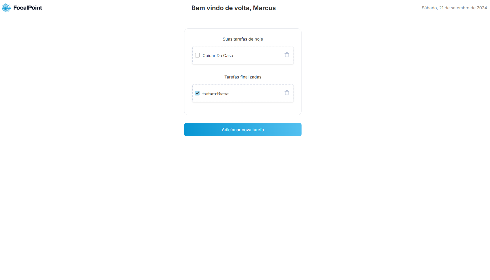
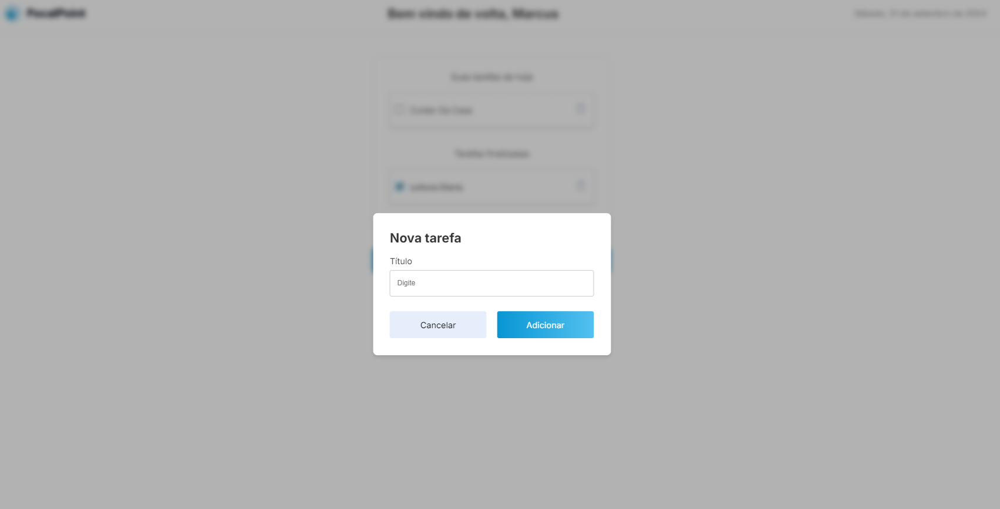
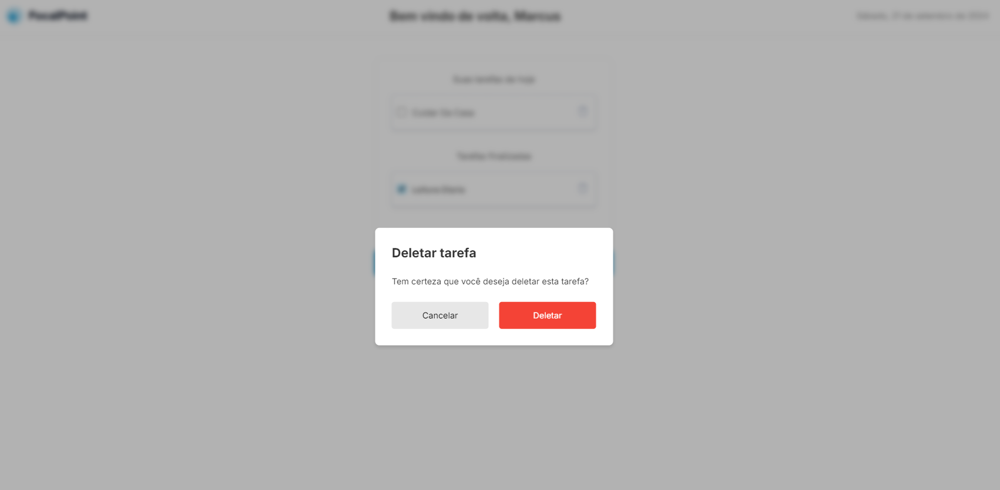

# 📝 Focalpoint

Focalpoint é um site voltado para gerenciamento de tarefas do dia a dia, desenvolvido como parte de um teste técnico para a empresa Focalpoint.

# 📷 Prints

<div style="display: flex; justify-content: space-between;">
  
  
  
</div>

## 👨‍💻 Tecnologias Utilizadas

- **Next JS**: Framework Javascript para o desenvolvimento da aplicação

- **Sass**: Usado para pré-processamento do css

- **TypeScript**: Superset do JavaScript que adiciona tipagem estática ao código.

- **Local Storage**: Armazenamento local de dados assíncrono em Next.

## 🛠️ Como Clonar e Executar o Projeto

1. **Clone o repositório:**

   ```bash
   git clone https://github.com/ruan-webdev/focalpoint.git
   cd mountfood-teste-tecnico
   ```

2. **Instale as dependências:**

   ```bash
   npm install
   ```

3. **Rode a aplicação:**

   ```bash
   npm run dev
   ```

## 📌 Observações

Certifique-se de ter as ferramentas necessárias configuradas para a intalação e execução do projeto (Node.JS)
